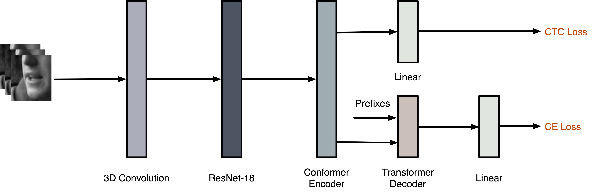

# Auto-AVSR: Lip-reading Sentences Project

## Update

`2025-01-06`: Reduced package dependencies.

`2023-07-26`: Released [real-time av-asr training code](https://github.com/pytorch/audio/tree/main/examples/avsr).

## Introduction

This repository is an open-sourced framework for speech recognition, with a primary focus on visual speech (lip-reading). It is designed for end-to-end training, aiming to deliver state-of-the-art models and enable reproducibility on audio-visual speech benchmarks.

<div align="center"></div>

By using this repository, you can achieve a word error rate (WER) of 20.3% for visual speech recognition (VSR) and 1.0% for audio speech recognition (ASR) on LRS3. This repository also provides API and pipeline tutorials.

## Setup

1. Install PyTorch (pytorch, torchvision, torchaudio) and necessary packages:

```Shell
pip install torch torchvision torchaudio pytorch-lightning sentencepiece av
```

2. Prepare the dataset. Please refer to [preparation](./preparation).

## Training

```Shell
python train.py --exp-dir=[exp_dir] \
                --exp-name=[exp_name] \
                --modality=[modality] \
                --root-dir=[root_dir] \
                --train-file=[train_file] \
                --num-nodes=[num_nodes]
```

<details open>
  <summary><strong>Required arguments</strong></summary>

- `exp-dir`: Directory to save checkpoints and logs to, default: `./exp`.
- `exp-name`: Experiment name. Location of checkpoints is `[exp_dir]`/`[exp_name]`.
- `modality`: Type of input modality, valid values: `video` and `audio`.
- `root-dir`: Root directory of preprocessed dataset.
- `train-file`: Filename of training label list.
- `num-nodes`: Number of machines used, default: 4.

</details>

<details>
  <summary><strong>Optional arguments</strong></summary>

- `group-name`: Group name of the task (wandb API).
- `val-file`: Filename of validation label list, default: `lrs3_test_transcript_lengths_seg16s.csv`.
- `test-file`: Filename of testing label list, default: `lrs3_test_transcript_lengths_seg16s.csv`.
- `gpus`: Number of gpus in each machine, default: 8.
- `pretrained-model-path`: Path to the pre-trained model.
- `transfer-frontend` Flag to load the front-end only, works with `pretrained-model-path`.
- `transfer-encoder` Flag to load the weights of encoder, works with `pretrained-model-path`.
- `lr`: Learning rate, default: 1e-3.
- `warmup-epochs`: Number of epochs for warmup, default: 5.
- `max-epochs`: Number of epochs, default: 75.
- `max-frames`: Maximal number of frames in a batch, default: 1600.
- `weight-decay`: Weight decay, default: 0.05.
- `ctc-weight`: Weight of CTC loss, default: 0.1.
- `train-num-buckets`: Bucket size for the training set, default: 400.
- `ckpt-path`: Path of the checkpoint from which training is resumed.
- `slurm-job-id`: Slurm job id, default: 0.
- `debug`: Flag to use debug level for logging

</details>


<details>
  <summary><strong>Note</strong></summary>

- For lrs3, you can fine-tune with a pre-trained lrw model at a learning rate of 0.001, or first train from scratch on a subset (23h, max duration=4sec) at 0.0002 (which is provided in model zoo), then fine-tune on the full set at 0.001. Script for subset creation is available at [here](./preparation/limit_length.py). For training new datasets, please refer to [instruction](INSTRUCTION.md).
- You can customise [logging](https://lightning.ai/docs/pytorch/stable/extensions/logging.html#supported-loggers) in lightning [`Trainer`](https://lightning.ai/docs/pytorch/stable/common/trainer.html#logger) for experiment tracking as needed.
- You can set `max-frames` to the largest to fit into your GPU memory.

</details>

## Testing

```Shell
python eval.py --modality=[modality] \
               --root-dir=[root_dir] \
               --test-file=[test_file] \
               --pretrained-model-path=[pretrained_model_path]
```

<details open>
  <summary><strong>Required arguments</strong></summary>

- `modality`: Type of input modality, valid values: `video` and `audio`.
- `root-dir`: Root directory of preprocessed dataset.
- `test-file`: Filename of testing label list, default: `lrs3_test_transcript_lengths_seg16s.csv`.
- `pretrained-model-path`: Path to the pre-trained model, set to `[exp_dir]/[exp_name]/model_avg_10.pth`, default: `null`.

</details>

<details>
  <summary><strong>Optional arguments</strong></summary>

- `decode-snr-target`: Level of signal-to-noise ratio (SNR), default: 999999.
- `debug`: Flag to use debug level for logging

</details>

## Model zoo

<details open>

<summary>LRS3</summary>

<p> </p>

| Model                                 | Training data (h)  |  WER [%]   |  Params (M) |    MD5            |
|---------------------------------------|:------------------:|:----------:|:-----------:|:------------------------:|
| [`vsr_trlrs3_23h_base.pth`](https://drive.google.com/file/d/1FDDTOBteJV8yBiJ8yePtZ-C-xR4s80rV/view?usp=sharing)             |        438          |    93.0    |     250     | fc8db  |
| [`vsr_trlrs3_base.pth`](https://drive.google.com/file/d/12PNM5szUsk_CuaV1yB9dL_YWvSM1zvAd/view?usp=sharing)                 |        438          |    36.0    |     250     | c00a7  |
| [`vsr_trlrs3vox2_base.pth`](https://drive.google.com/file/d/1shcWXUK2iauRhW9NbwCc25FjU1CoMm8i/view?usp=sharing)             |        1759         |    24.6    |     250     | 774a6  |
| [`vsr_trlrs2lrs3vox2avsp_base.pth`](https://drive.google.com/file/d/1r1kx7l9sWnDOCnaFHIGvOtzuhFyFA88_/view?usp=sharing)     |        3291         |    20.3    |     250     | 49f77  |
| [`asr_trlrs3_base.pth`](https://drive.google.com/file/d/1IBMkI7XyZo8mF3rz109rXrMH7MyxRuiY/view?usp=sharing)                 |        438          |    2.0     |     243     | 8af72  |
| [`asr_trlrs3vox2_base.pth`](https://drive.google.com/file/d/1YN9lwZN6iWn2qNQRpfpGpnf2r6ZTQqVT/view?usp=sharing)             |        1759         |    1.0     |     243     | f0c5c  |

Some results are slightly better than in the paper due to hyper-parameter optimisation. The av-asr code and checkpoint can be found on the released version.

</details>


## Tutorials

We provide the following tutorials and will include more:
- [x] [Cropping Mouth from Video](./tutorials/mouth_cropping.ipynb)
- [x] [Audio/Visual Speech Recognition](./tutorials/inference.ipynb)
- [x] [Feature Extraction](./tutorials/feature_extraction.ipynb)

## Citation

If you find this repository helpful, please consider citing our work:

```bibtex
@inproceedings{ma2023auto,
  author={Ma, Pingchuan and Haliassos, Alexandros and Fernandez-Lopez, Adriana and Chen, Honglie and Petridis, Stavros and Pantic, Maja},
  booktitle={IEEE International Conference on Acoustics, Speech and Signal Processing (ICASSP)},
  title={Auto-AVSR: Audio-Visual Speech Recognition with Automatic Labels},
  year={2023},
  pages={1-5},
  doi={10.1109/ICASSP49357.2023.10096889}
}
```

## Acknowledgement

This repository is built using the [torchaudio](https://github.com/pytorch/audio), [espnet](https://github.com/espnet/espnet), [raven](https://github.com/ahaliassos/raven) and [avhubert](https://github.com/facebookresearch/av_hubert) repositories.

## License

Code is Apache 2.0 licensed. The pre-trained models provided in this repository may have their own licenses or terms and conditions derived from the dataset used for training.

## Contact

Contributions are welcome; feel free to create a PR or email me:

```
[Pingchuan Ma](mapingchuan0420[at]gmail.com)
```
